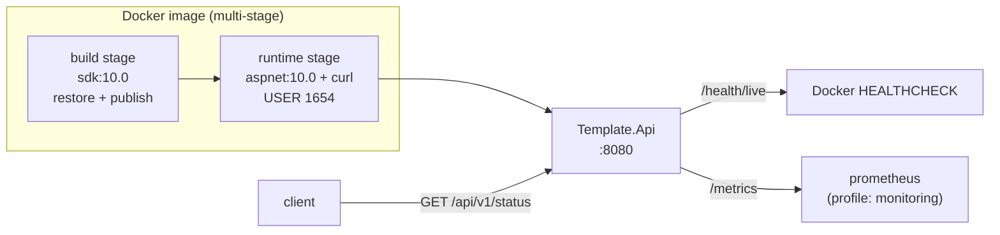

# docker-dotnet-template

[](https://github.com/TiagoR85/docker-dotnet-template/actions/workflows/ci.yml)
[](https://github.com/TiagoR85/docker-dotnet-template/actions/workflows/codeql.yml)
[](LICENSE)
[](https://dotnet.microsoft.com/)

A production-minded starter for containerizing ASP.NET Core apps: multi-stage
build, non-root runtime, healthchecks, Prometheus metrics and a CI pipeline
that gates coverage and image vulnerabilities. I use it as the base for every
.NET service in my portfolio.

## Architecture



Design rationale lives in [`docs/adr/`](docs/adr/).

## Quickstart

```bash
git clone https://github.com/TiagoR85/docker-dotnet-template.git
cd docker-dotnet-template
docker compose up -d --build
curl http://localhost:8080/api/v1/status
```

| Endpoint | Purpose |
|---|---|
| `GET /api/v1/status` | Service name, version, environment, server time |
| `GET /health/live` | Liveness probe (used by Docker HEALTHCHECK) |
| `GET /health/ready` | Readiness probe |
| `GET /metrics` | Prometheus metrics |

With monitoring (Prometheus on http://localhost:9090):

```bash
docker compose --profile monitoring up -d
```

Copy `.env.example` to `.env` to override defaults — no secrets are required.

## Local development

```bash
dotnet restore DockerDotnetTemplate.slnx
dotnet run --project src/Template.Api --urls http://localhost:5199
```

## Tests and coverage gate

```bash
dotnet test tests/Template.Api.Tests/Template.Api.Tests.csproj -c Release `
  -p:CollectCoverage=true -p:CoverletOutputFormat=cobertura `
  -p:Threshold=80 -p:ThresholdType=line
```

CI enforces **≥ 80% line coverage** and fails the image job on HIGH/CRITICAL
vulnerabilities (Trivy, unfixed ignored).

## Decisions

- [ADR-0001 — multi-stage build](docs/adr/0001-multi-stage-build.md)
- [ADR-0002 — non-root user](docs/adr/0002-run-as-non-root.md)
- [ADR-0003 — compose profiles](docs/adr/0003-compose-profiles-for-monitoring.md)
- [ADR-0004 — vulnerability gating](docs/adr/0004-vulnerability-gating-in-ci.md)

## Roadmap

- [x] Multi-stage image with healthcheck and non-root user
- [x] Compose stack with opt-in Prometheus
- [x] CI with coverage and vulnerability gates
- [ ] Distroless runtime variant once probes are external
- [ ] SBOM generation on release

## License

MIT — see [LICENSE](LICENSE).
